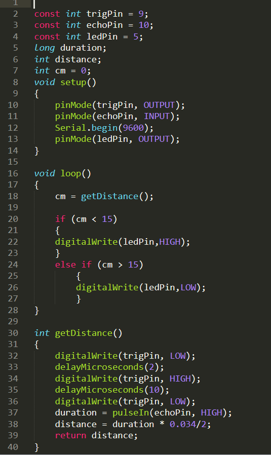
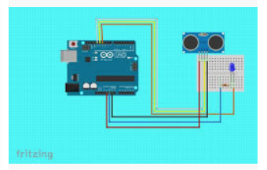

# NotSoBasicArduino

Not so basic arduino was an arduino module that was at first review,
and then quickly got into using arduino along with the technology
    we'll be using for the Ultrasonic Sensor Project.
    
## Hello Functions

### Description

   I started working on Hello Functions right after I finished the first
Ultrasonic Sensor project, so I just made a copy of that code and used a
function to take the distance of an object from the sensor.

 ### Code Screenshot
 
 
 
 ### Wiring Diagram
 
 
 
 ### Commented Code

### Lesson Learned

 It is very helpful to convert coded commands into functions.
Convert your commands into functions, then test each function individually
to make sure they work. This frees up space for the logic code at the top 
(w/ if and else statements). This simplifies and compacts your code, while
making problems with the code easier to fix.

## NewPing

### Description

    NewPing was about learning to use an ultrasonic sensor. For the assignment,
I wired up a button as well as the ultrasonic sensor to the arduino. I then coded it
so every time I pressed the button, the ultrasonic sensor would print out a distance
on the serial monitor.

### Lessons Learned

    The main thing I learned from NewPing was how to take a distance measurement,
and how the ultrasonic sensor works. The ultrasonic sensor actually uses echolocation
to determine distance from an object. The trig pin sends out a signal from the sensor,
and the echo pin listens for the returning echos.

## PhotoInterrupter

### Description

    For this assignment, I had to learn how to use a photointerrupter. I wired it 
up to the arduino and using an interrupt command, had it print out a 1 if something
was inbetween the arms of the photointerrupter.

### Lessons Learned

* The photointerrupter works by shooting a continuos beam of light from one arm to
another, and if something interrupts that light, the photointerrupter reads that and
sends out an electrical signal. 
* The only catch is the timing. The photointerrupter can't continuosly check to see if
the beam was interrupted, so it runs a loop. In order to solve the inherent timing issue,
you must use an attachinterrupt command.
* The format for this command is attachInterrupt(digitalPinToInterrupt(pin), ISR, mode).
